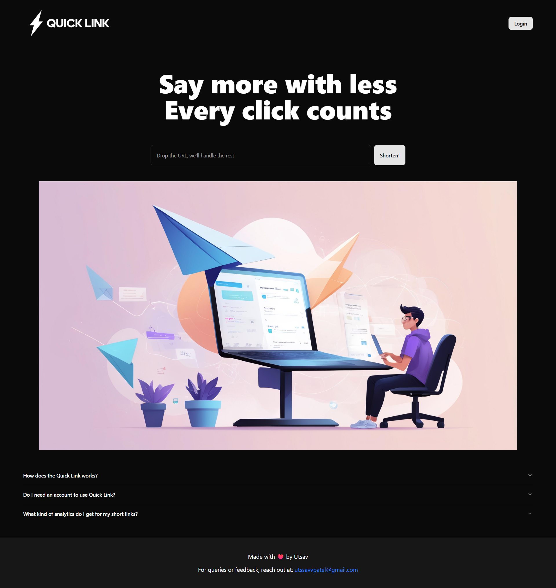

  

## 📌 About

**Quick Link** is a modern, fast, and user-friendly URL shortener that lets you:

-   Create short URLs from long ones
-   Customize your short links
-   Instantly generate and download QR codes
-   Track click analytics including device type and city-level location

No fluff — just clean, efficient link sharing with real-time insights.

## ⚙️ Tech Stack

-   **Frontend**: React, Tailwind CSS, ShadCN (Radix UI components)
-   **Backend**: Supabase (Database & Auth)
-   **Routing**: React Router
-   **QR Code**: React QRCode Logo
-   **Analytics**: Recharts + UA-Parser-JS

## ✨ Features

-   🔗 Custom and random URL shortening
-   📱 QR code generation for every link
-   📊 Click tracking with device and location data
-   📈 Interactive charts for stats visualization
-   🧼 Clean, responsive UI using ShadCN components
-   📋 One-click copy to clipboard

## 🌐 Live Website

Check out the live version of **Quick Link** here:  
[Quick Link Live](https://quick-link-black.vercel.app/)

Say more with lessEvery click counts

## 🖼️ Preview

  

## 📬 Connect

For questions or support, contact:

-   **Gmail**: [utssavvpatel@gmail.com](mailto:utssavvpatel@gmail.com)
-   **LinkedIn**: [Utsav Patel](https://www.linkedin.com/in/utsxvv)
-   **GitHub**: [@utsxvv](https://github.com/utsxvv)

  Made with ❤️ by UTSAV

